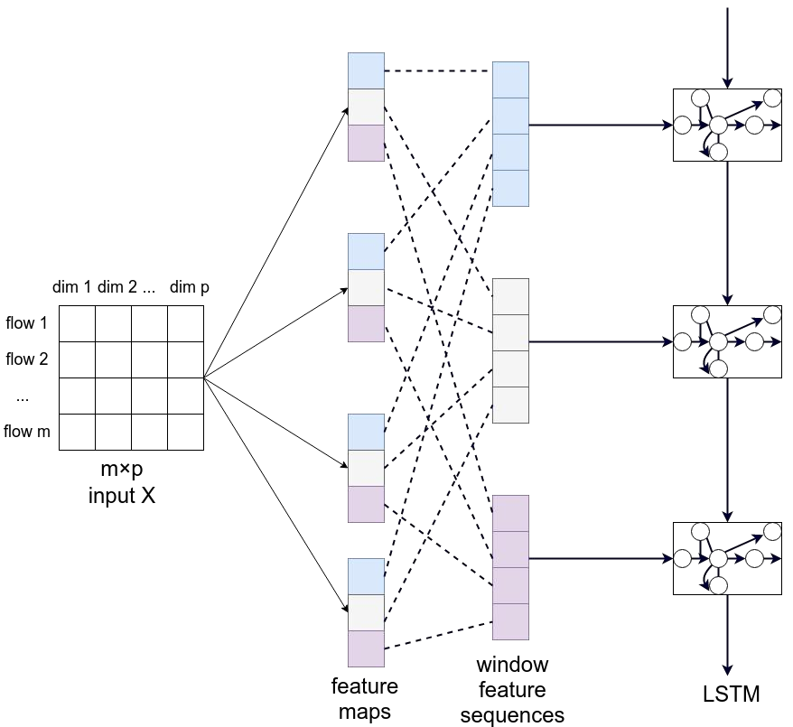
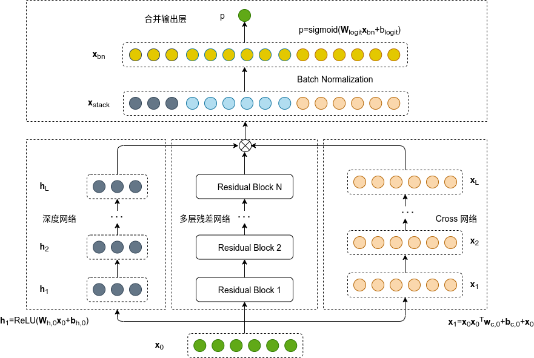
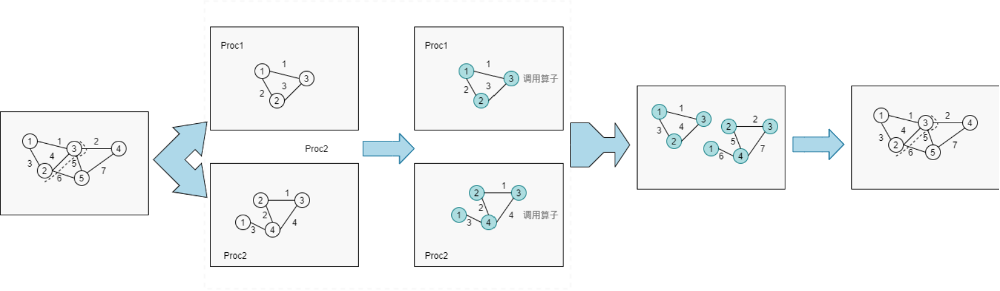
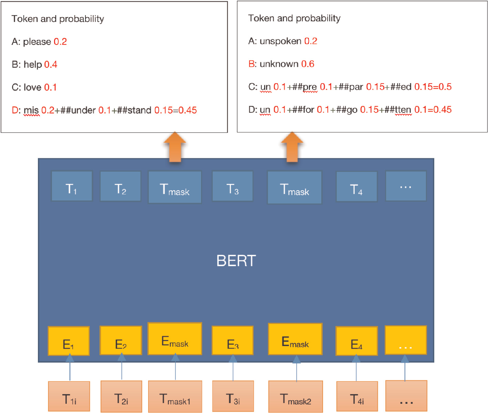

<!--
 * @Descripttion: 
 * @Version: 1.0
 * @Author: ZhangHongYu
 * @Date: 2022-03-13 11:15:04
 * @LastEditors: ZhangHongYu
 * @LastEditTime: 2022-03-13 14:10:27
-->
# Info

- 🏫 Edu: Harbin Institute of Technology(Shenzhen), Computer Science
- 🔭 Interest: distributed/federated machine learning, large scale optimization
- 📒 Blog: https://www.cnblogs.com/orion-orion/ 

# Overview

# Project
## CNN-LSTM Flow Analysis
本项目为2020年中国高校计算机大赛(C4)－网络技术挑战赛EP2赛项，题目需要我们实时识别出网络上的正常业务流量、恶意软件流量和网络攻击流量。我们采用 CNN+LSTM 时空神经网络模型，CNN 神经网络学习流量的局部特征信息, LSTM 神经网络学习流量在序列特征信息，最终的系统能实时地完成对流量的分类和恶意流量的准确识别。

 

## Bagging+DCRN financial data prediction

本项目为泰迪杯2021A题《基于 Bagging 和深度学习的上市公司财务数据造假预测》，要求我们确定出各行业与财务数据造假相关的数据指标，确定出第6年财务数据造假的上市公司。我们以MLP，多层残差网络，Cross网络为子网络构建了(Deep-Cross-Residual-NetWork,DCRN)网络模型，此外结合Bagging集成，进一步降低模型的方差(Variance)，从而提高模型的泛化能力。 最该在测试集上的AUC得分为 83.32%，高于所有单独的机器学习模型。

 

## 基于太湖之光超算平台的分布式图计算优化
该项目为2020年国产CPU并行应用挑战赛决赛赛题，为在神威太湖之光平台上对大规模图计算的算法进行优化。 我们在项目中基于MPI实现集群间通信，基于Athread实现众核多线程并行计算，采用数据并行的划分方式，充分发挥计算平台的性能。此外，我们针对节点数目不同的图采用不同的分布式存储方式，充分减少通信开销。 该算法最终在上亿节点的大规模数据集上达到了200%的加速比。

 

## ALBert cloze test

本项目为2020-2021年ASC世界大学生超级计算机竞赛第3题，题目为训练机器学习模型完成一个完形填空形式的NLP任务，我们采用ALBert模型，使用赛方给定的数据集进行微调和测试, 最终在ALBert-xxlarge的预训练模型下达到90%的准确率。

 

<!--
**lonelyprince7/lonelyprince7** is a ✨ _special_ ✨ repository because its `README.md` (this file) appears on your GitHub profile.

Here are some ideas to get you started:

- 🔭 I’m currently working on ...
- 🌱 I’m currently learning ...
- 👯 I’m looking to collaborate on ...
- 🤔 I’m looking for help with ...
- 💬 Ask me about ...
- 📫 How to reach me: ...
- 😄 Pronouns: ...
- ⚡ Fun fact: ...
-->
